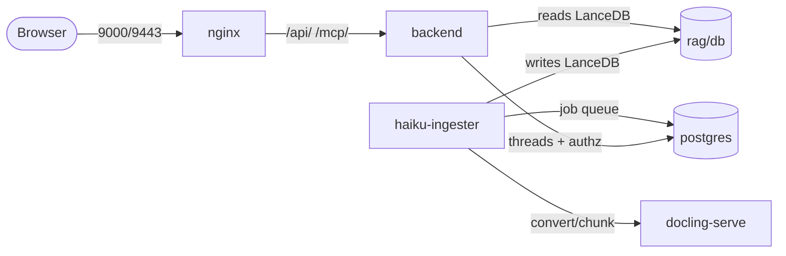

# Service graph

The stack is defined in `docker-compose.yml`. Several services cooperate; two of
them share the RAG vector store through a bind mount. The `tui` service is
optional (see [tui](#tui) below).

## nginx

Serves the Flutter web frontend (built from the `soliplex/frontend` release
tarball inside `nginx/Dockerfile`) and reverse-proxies `/api/` and `/mcp/` to
`backend:8000`. Terminates TLS on `9443` with a self-signed cert generated at
build time.

## backend

Runs `soliplex-cli serve /environment`. **Currently launched with
`--no-auth-mode`** (marked temporary in `docker-compose.yml`). The
`--reload=config` flag means edits under `backend/environment/` take effect
without a rebuild. The backend is installed from the pinned `soliplex` package;
see [Backend image & dependencies](backend.md).

## haiku-ingester

The **writer** process for the LanceDB at `rag/db/`. Runs `haiku-ingester serve`
with a Postgres-backed job queue (its own `soliplex_ingester` database), an
async worker pool, retries + a dead-letter queue, and an HTTP control plane on
`8765`. The
filesystem source polls `rag/docs/` and emits upsert/delete jobs that
docling-serve converts and chunks.

There is a **single-writer constraint**: only one ingester per LanceDB. The
backend reads the same LanceDB through a bind mount, so no separate MCP server
is needed. See [RAG pipeline](../operations/rag.md) and
[Ingester control plane](../operations/ingester.md).

## docling-serve

A stateless document converter. The CPU image is used by default; a GPU variant
is available by a commented swap in `docker-compose.yml`.

## tui

Soliplex's [Textual](https://textual.textualize.io/) terminal client. The
backend image bundles the client (`soliplex-tui`), so you can run it from the
command line against the running stack without the `tui` service — see
[Using the TUI](../getting-started/installation.md#using-the-tui).

This template also serves the same client as a web app via the **optional**
`tui` service (over
[textual-serve](https://github.com/Textualize/textual-serve)); nginx proxies it
at `/tui/`, so open <https://localhost:9443/tui/>. The service has no host port
mapping (reached only through nginx) and a project scaffolded by the
[generator](../getting-started/generator.md) includes it only when
`include_tui=true`.

## postgres

Creates two databases on first boot via `postgres/config/init.sh`:

- `soliplex_agui` — thread persistence
- `soliplex_authz` — authorization policy

Each database gets a dedicated low-privilege role whose password is read from
`/run/secrets/<name>_db_password`. Init runs **only on an empty data volume**;
to re-run it, `docker compose down -v` first.
