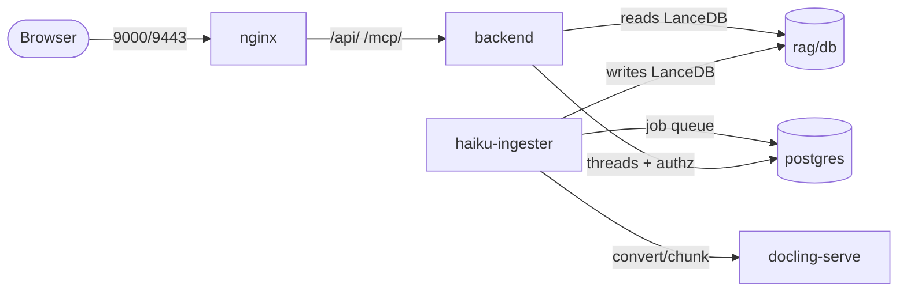

# Service graph

<!-- site-only -->
!!! note "About this page"
    This documents a stack **generated from `soliplex-template`**. A generated
    project ships its own copy of this page without this note.
<!-- endsite-only -->

The stack is defined in `docker-compose.yml`. Several services cooperate; two
of them share the RAG vector store through a bind mount.

## nginx

Serves the Flutter web frontend (built from a `soliplex/frontend` release in
`nginx/Dockerfile`) and reverse-proxies `/api/` and `/mcp/` to `backend:8000`.
Terminates TLS on host port 9443 with a self-signed cert.

## backend

Runs `soliplex-cli serve /environment`, installed from the pinned `soliplex`
package (see [Backend image & dependencies](backend.md)). The `--reload=config`
flag means edits under `backend/environment/` take effect without a rebuild.

## haiku-ingester

The **writer** for the LanceDB at `rag/db/`. Runs `haiku-ingester serve` with a
Postgres-backed job queue (its own `soliplex_ingester` database), an async
worker pool, retries + a dead-letter queue, and an HTTP control plane on host
port 8765. There is a **single-writer constraint**: only one
ingester per LanceDB. The backend reads the same store through a bind mount.
See [RAG pipeline](../operations/rag.md).

## docling-serve

A stateless document converter (CPU image by default; a GPU variant is a
commented swap in `docker-compose.yml`).
<!-- if:tui -->

## tui

Soliplex's [Textual](https://textual.textualize.io/) terminal client, served
as a web app over textual-serve; nginx proxies it at `/tui/`, so open
<https://myproject.localhost:9443/tui/>. The same client is bundled in
the backend image — to run it from the command line, see
[Using the TUI](../getting-started/installation.md#using-the-tui).
<!-- endif -->

## postgres

Creates the stack's databases on first boot via `postgres/config/init.sh`:

- `soliplex_agui` (thread persistence)
- `soliplex_authz` (authorization policy)
- `soliplex_ingester` (the haiku-ingester job queue)
  <!-- if:gitea -->
- `soliplex_gitea` (Gitea's backing store)
  <!-- endif -->

Each gets a dedicated low-privilege role whose password is a Docker secret.

Init runs **only on an empty data volume**; to re-run it,
`docker compose down -v` first.

<!-- if:gitea -->

## gitea

A local [Gitea](https://about.gitea.com/) instance (rootless image), backed by
the `soliplex_gitea` Postgres database. nginx reverse-proxies it under `/gitea/`
on the HTTPS port — open <https://myproject.localhost:9443/gitea/> — and its
built-in SSH and HTTP are published on host ports `2222` and `3000`. State lives
in the `gitea_data` / `gitea_config` named volumes. Provision it after first
boot with `scripts/init_gitea.py` — see
[Provision Gitea](../getting-started/installation.md#provision-gitea).
<!-- endif -->
